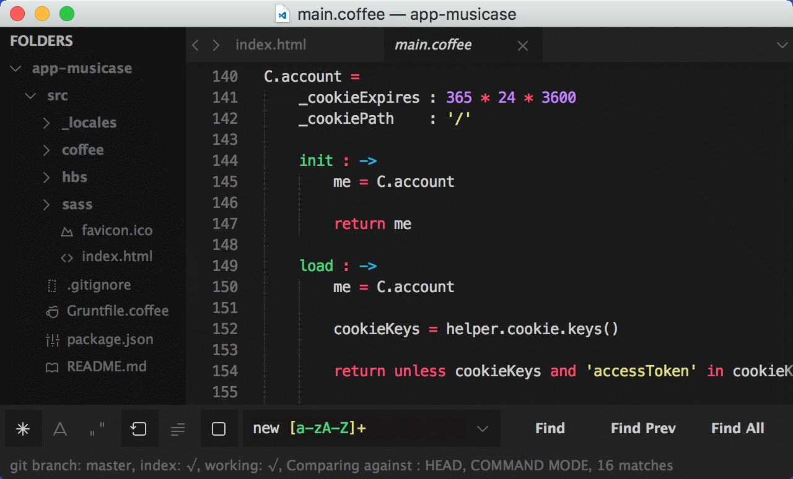
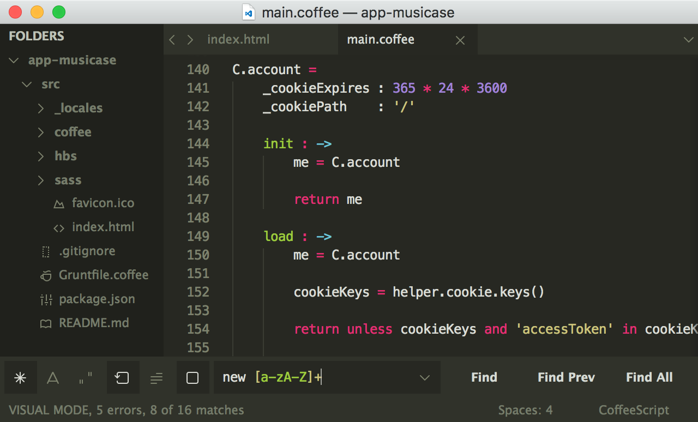

# amCoder

A Hyperminimal UI Theme for Sublime Text 2/3 with Love of Monokai.

Inherited from [Spacegray](https://github.com/kkga/spacegray).
**Optimized for Monokai!**

### Previews

Default version:



Classic version:



***

### How to Install

#### Via Package Control

The easiest way to install is using [Sublime Package Control](https://sublime.wbond.net), where amCoder is listed as `Theme - amCoder`.

1. Open Command Palette using menu item `Tools -> Command Palette...` (⇧+⌘+P on Mac)
2. Choose `Package Control: Install Package`
3. Find `Theme - amCoder` and hit Enter

#### Manual

You can also install the theme manually:

1. [Download the .zip](https://github.com/auiWorks/amCoder/archive/master.zip)
2. Unzip and rename the folder to `Theme - amCoder`
3. Copy the folder into `Packages` directory, which you can find using the menu item `Sublime Text -> Preferences -> Browse Packages...`

### How to Activate

Activate the UI theme and color scheme by modifying your user preferences file, which you can find using the menu item `Sublime Text -> Preferences -> Settings - User` (⌘+, on Mac).

**Note: Don't forget to restart Sublime Text after activating the theme.**

#### Theme Settings

Default version:

```json
{
  "theme": "amCoder.sublime-theme"
}
```

Classic version:

```json
{
  "theme": "amCoder Classic.sublime-theme"
}
```

#### Color-Scheme

amCoder looks best with these modified versions of Monokai:

Default version:

```json
{
  "color_scheme": "Packages/Theme - amCoder/amCoder.tmTheme"
}
```

Default (Bright) version:

```json
{
  "color_scheme": "Packages/Theme - amCoder/amCoder (Bright).tmTheme"
}
```

Classic version:

```json
{
  "color_scheme": "Packages/Theme - amCoder/amCoder Classic.tmTheme"
}
```

Classic (Bright) version:

```json
{
  "color_scheme": "Packages/Theme - amCoder/amCoder Classic (Bright).tmTheme"
}
```
